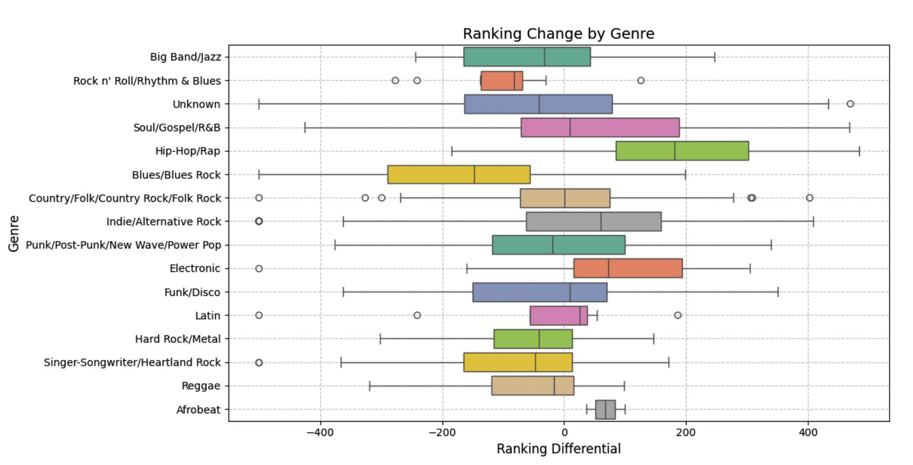
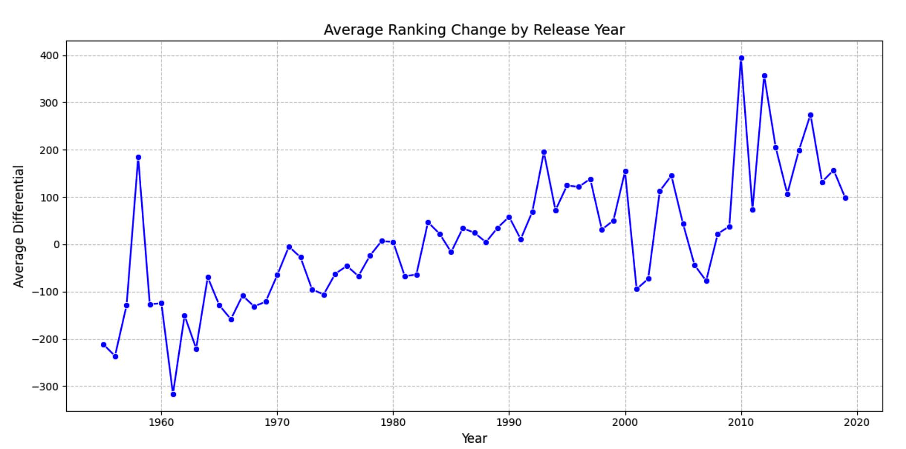
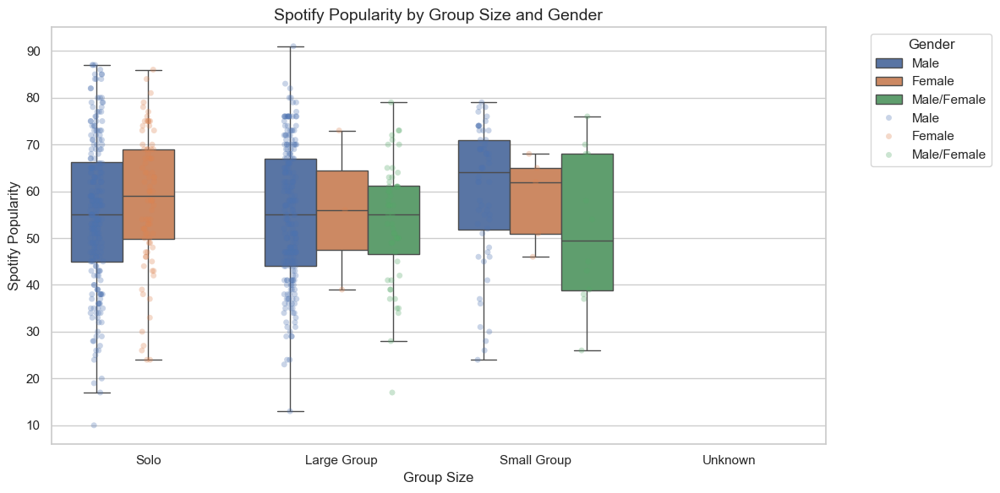
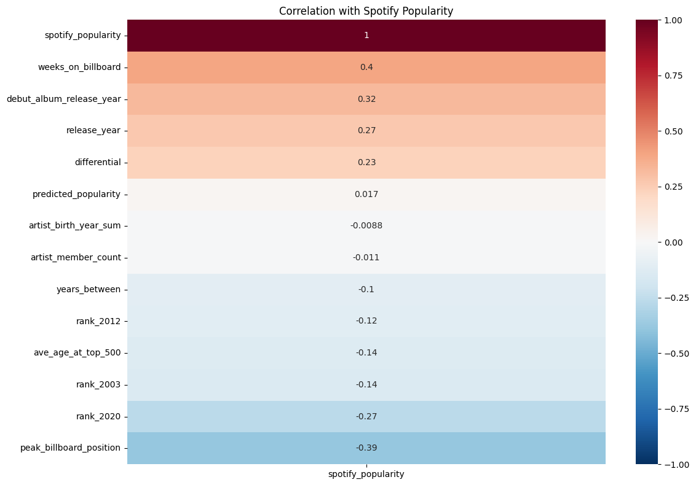
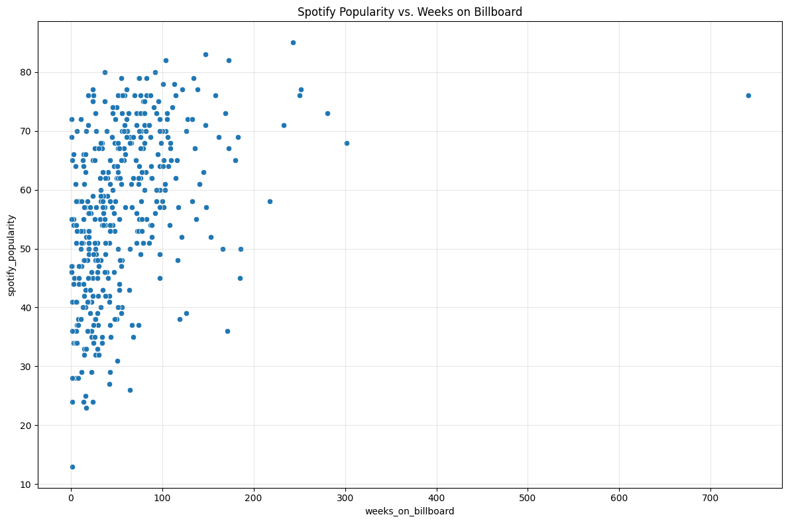
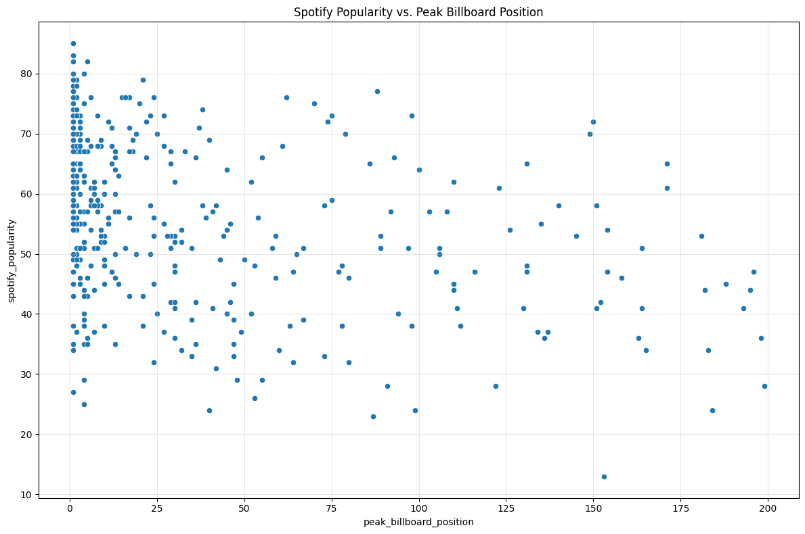

# Data Visualization Project 1

## Write-up: Analysis of Rolling Stone's Top 500 Albums Dataset

---

## 1. Introduction

This report presents an exploratory data analysis of the Rolling Stone's Top 500 Albums dataset, published on May 7, 2024, as part of the TidyTuesday initiative. The dataset compiles album rankings from three editions of the Rolling Stone Magazine’s “Greatest Albums of All Time” lists, published in 2003, 2012, and 2020. In addition to rankings, the dataset includes rich metadata on each album such as release year, genre, artist information, Billboard chart performance, and Spotify popularity. This multifaceted dataset enables us to explore the evolution of music perception over time, how commercial success intersects with critical acclaim, and whether demographic attributes of artists play a role in how their work is received. The following report investigates two specific questions derived from this dataset, with the aim of uncovering patterns and trends that shed light on how music is ranked and remembered.

- **Source:** [TidyTuesday Rolling Stone Album Rankings Dataset](https://github.com/rfordatascience/tidytuesday/tree/main/data/2024/2024-05-07)
- **Original Publisher:** Rolling Stone Magazine
- **Data Collection:** Information compiled from Rolling Stone’s published rankings, Billboard statistics, and Spotify metadata

### **Dataset Dimensions**

- **Number of Observations:** 500 albums
- **Number of Variables:** 15+ (including numerical and categorical data)
- **Key Variables:**

  - **Numerical Variables:**
    - `rank_2003`, `rank_2012`, `rank_2020` (album rankings over the years)
    - `differential` (ranking change between 2020 and 2003)
    - `release_year` (year the album was released)
    - `spotify_popularity` (Spotify popularity score)
    - `weeks_on_billboard` (number of weeks on Billboard charts)
    - `peak_billboard_position` (highest position on Billboard charts)
  - **Categorical Variables:**
    - `album` (album title)
    - `artist` (artist or band name)
    - `genre` (album genre)
    - `artist_gender` (gender classification of the artist)
    - `type` (album classification, e.g., studio, live, compilation)

- **Full Data Dictionary:** [Rolling Stone Data Documentation](https://github.com/rfordatascience/tidytuesday/blob/main/data/2024/2024-05-07/readme.md#rolling_stonecsv)

## 2. Question 1: How do an Album's Genre and Release Year Influence Its Ranking Changes from 2003 to 2020?

This question examines how an album’s genre and release year affect its ranking changes between 2003 and 2020, using the `differential` variable (rank_2020 - rank_2003), where negative values indicate improved rankings. The key variables are genre, release_year, and differential. Understanding these influences can reveal how musical tastes and critical evaluations evolve, shedding light on whether specific genres or historical periods gain or lose favor over time. We are interested in this question because it connects cultural trends to music rankings, offering insights into the longevity and shifting appreciation of albums across decades and styles.

**Approach**:

We will create two distinct visualizations. First, a box plot will display ranking changes (differential) by genre, using color mapping to differentiate genres. Box plots are ideal here because they summarize the distribution (median, quartiles, outliers) of ranking changes, enabling clear comparisons across genres. The color mapping enhances visual distinction, making patterns more accessible. Second, a line plot will show the average ranking change by release year. This plot suits the continuous nature of release_year, revealing temporal trends and highlighting whether older or newer albums experience more significant ranking shifts. Together, these plots provide a comprehensive view of genre and time effects.


Figure 1: Certain genres such as Reggae and Rock 'n' Roll/Rhythm & Blues generally declined while genres like Hip-Hop/Rap and Electronic rose significantly.


Figure 2: Ranking of releases from different years has changed over time, with greater ranking stability for older album and increased variability for more recent decades.

**Analysis**

The code to generate the box plot and line plot is as follows:

```python
sns.boxplot(y='genre', x='differential', data=df, hue='genre', palette='Set2', legend=False)
```

```python
decade_avg = df.groupby('release_year')['differential'].mean().reset_index()
sns.lineplot(x='release_year', y='differential', data=decade_avg, marker='o', color='b')
```

To confirm this, we also performed an ANOVA test:

```python
from scipy.stats import f_oneway

genre_groups = [df['differential'][df['genre'] == g] for g in df['genre'].unique()]
anova_result = f_oneway(*genre_groups)
print(f"ANOVA p-value for genre vs differential: {anova_result.pvalue:.4f}")
# If p < 0.05, genre likely influences differential significantly
```

**Discussion**
The box plot reveals that genre significantly influences ranking changes. Genres like Hip-Hop/Rap show a wide range of differentials, including substantial improvements (negative values), suggesting a growing critical appreciation, possibly due to cultural shifts favoring newer styles. Conversely, Blues/Blues Rock exhibits more stable rankings, with less variability, indicating enduring recognition. An ANOVA test (p = 0.0000) confirms genre’s significant effect.

The line plot indicates that older albums (1950s–1970s) generally improved in rank (negative differentials), while newer albums (1990s–2000s) often declined. This trend may reflect a nostalgia effect or a reevaluation of classic works as timeless, whereas recent albums face fluctuating opinions over time. The combination suggests that both genre-specific trends and release timing shape ranking stability, with older, established genres gaining favor in modern assessments.

## 3. Question 2: How Do Artist Gender and Group Size Affect Album Popularity on Spotify?

This question explores how artist gender and group size influence an album’s Spotify popularity, using artist_gender, artist_member_count, and spotify_popularity. Understanding these factors can uncover potential biases or preferences in streaming behavior, reflecting listener demographics or industry dynamics. I’m drawn to this question because it bridges artist identity with modern music consumption, offering insights into whether traditional demographics impact digital success.

**Approach**

We will use a box plot to show the relationship between group size (artist_member_count) and Spotify popularity, overlaid with a regression line to assess trends. Box plots are effective for continuous variables, revealing individual data points and overall patterns, with color distinguishing gender effects.



**Analysis**

The code to generate the box plot is as follows:

```python
def group_size(n):
    if pd.isna(n):
        return "Unknown"
    elif n == 1:
        return "Solo"
    elif n <= 3:
        return "Small Group"
    else:
        return "Large Group"

df["group_size"] = df["artist_member_count"].apply(group_size)

# Keep only rows with valid Spotify popularity values
df_plot = df[df["spotify_popularity"].notna()]

# === Boxplot + Stripplot by group_size and artist_gender ===
sns.boxplot(data=df_plot, x="group_size", y="spotify_popularity", hue="artist_gender", showfliers=False)
sns.stripplot(data=df_plot, x="group_size", y="spotify_popularity", hue="artist_gender",
              dodge=True, jitter=True, alpha=0.3, linewidth=0)
```

We also performed a correlation matrix to explore the relationship between the variables, and scatter plots to visualize the relationship between the variables and spotify_popularity.

```python
numerical_features = df.select_dtypes(include=[np.number])
correlations = numerical_features.corr()['spotify_popularity'].sort_values(ascending=False)
sns.heatmap(numerical_features.corr()[['spotify_popularity']].sort_values(by='spotify_popularity', ascending=False), annot=True, cmap='RdBu_r', vmin=-1, vmax=1)
```

```python
sns.scatterplot(x='release_year', y='spotify_popularity', data=df)
sns.scatterplot(x='weeks_on_billboard', y='spotify_popularity', data=df)
```

**Discussion**

The Figure 3 reveals that Solo female artists tend to have slightly higher median Spotify popularity than solo male artists.
Among large groups, male-led acts are generally more prominent, but female and mixed-gender groups have similar ranges, indicating balanced popularity. Small groups show more variation, especially for mixed-gender compositions, which exhibit a broader distribution and a lower median — suggesting they are either breakout hits or underrepresented. The "Unknown" category lacks enough data to draw conclusions.

=> This suggests that neither artist gender nor group size strongly influences Spotify popularity in this dataset. Listener preferences may prioritize other factors, like genre or marketing, over artist demographics. The dataset’s focus on top albums might also mask broader trends, as these works already enjoy high recognition.

**Further Analysis**

Having established that neither artist gender nor group size meaningfully explains Spotify popularity, we investigated other variables in the dataset to uncover stronger predictors. A correlation matrix (see attached heatmap) reveals that several features exhibit higher correlations with spotify_popularity—notably, the number of weeks on Billboard (0.4), debut album release year (0.32), and release year (0.27). This suggests that historical commercial performance (i.e., Billboard metrics) and an album’s chronological context may be more influential than demographic attributes like gender or band size.



We then choose to focus on the "peak_billboard_position" and "weeks_on_billboard" variables to further explore the relationship between Spotify popularity and historical commercial performance.





The 2 figures above show that: Albums that accumulated a greater number of weeks on the Billboard charts show a moderate positive association with Spotify popularity; while not a perfect linear relationship, we observe a clustered trend where high Billboard longevity often corresponds to higher Spotify popularity scores. Similarly, peak Billboard position shows a negative correlation (-0.39), meaning that albums reaching lower (better) chart positions—e.g., #1, #2—tend to achieve higher Spotify popularity than those peaking near the bottom of the charts.

Meanwhile, release year (and the related variable debut_album_release_year) can influence popularity by affecting how much an album is “rediscovered” or streamed in later eras. More recent releases (2000s onward) may leverage the modern streaming infrastructure and younger audiences, increasing their Spotify metrics. In contrast, older albums with iconic status might see renewed interest but do not always match the performance of contemporary hits on streaming platforms.

These findings highlight that while artist-level demographics may be inconsequential for Spotify popularity, Billboard success and an album’s time of release more robustly predict streaming performance, pointing toward the importance of long-term commercial resonance and the historical moment in which a record is introduced.

## 4. Conclusion:

This analysis of the Rolling Stone Album Rankings dataset reveals distinct patterns in the factors influencing album rankings and Spotify popularity. For Question 1, we found that genre and release year significantly impact ranking changes from 2003 to 2020. Older albums, particularly from the 1950s to 1970s, and genres like Hip-Hop/Rap, tend to improve in rank over time, reflecting a possible nostalgia effect or growing critical appreciation for certain styles. This underscores how cultural shifts and historical context shape the perceived greatness of albums over decades.

For Question 2, while artist gender and group size showed no significant effect on Spotify popularity, further analysis identified stronger predictors. Notably, "peak_billboard_position" emerged with a moderate negative correlation (-0.39), indicating that albums with better Billboard chart positions tend to have higher Spotify popularity. "Weeks_on_billboard" (0.4) also showed a positive correlation, suggesting that sustained chart presence enhances streaming success. These findings highlight the enduring influence of historical commercial success on modern streaming metrics, overshadowing demographic factors like gender or group size.

Together, these insights suggest that critical acclaim and commercial performance play pivotal roles in both historical rankings and contemporary popularity, often more than artist demographics. However, the dataset’s focus on the top 500 albums may limit generalizability, as it excludes less critically acclaimed works that might dominate streaming platforms. For future work, we recommend incorporating additional datasets such as global rankings, recent streaming trends, or listener demographics to further enrich the analysis and validate the findings across broader contexts. This would provide a more comprehensive understanding of the evolving dynamics of music appreciation in both critical and digital spheres.
